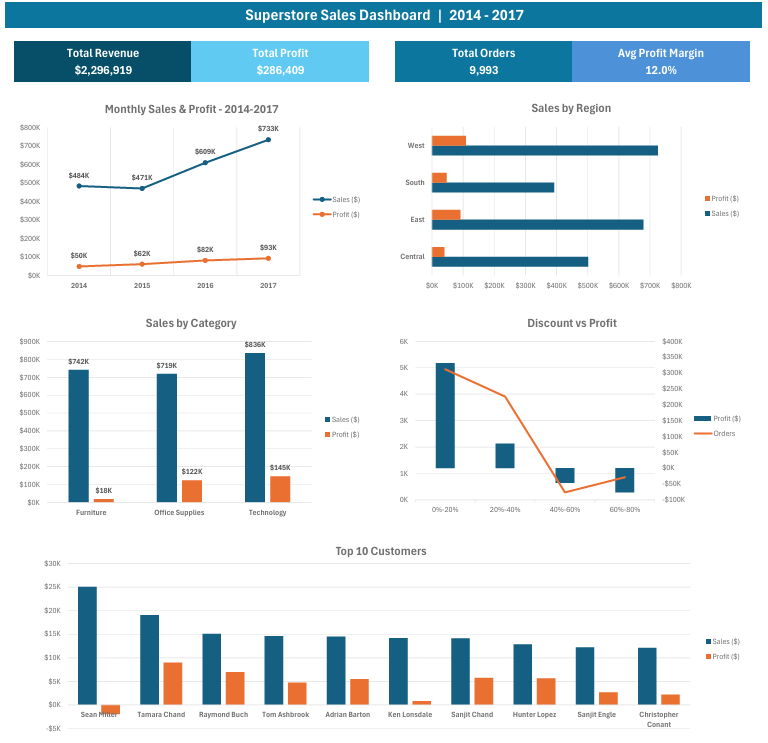

# 📊 Superstore Sales Dashboard

## Project Overview
Analysis of the Kaggle Superstore dataset using Microsoft Excel.
The goal was to clean, analyse, and visualise sales data to identify 
revenue trends, regional performance, and profit drivers.

---

## Dataset
- **Source:** [Kaggle — Superstore Sales Dataset](https://www.kaggle.com/datasets/vivek468/superstore-dataset-final)
- **Original format:** CSV
- **Period covered:** 03/01/2014 to 30/12/2017
- **Rows after cleaning:** 9,993 unique order lines
- **Total Revenue:** $2,296,919
- **Total Profit:** $286,409

---

## File Structure

| Sheet | Description |
|---|---|
| `Raw_Data` | Original downloaded data, never modified |
| `Clean_Data` | Cleaned dataset with Profit Margin and Shipping Days columns added |
| `Analysis` | All 5 Pivot Tables and supporting calculations |
| `Dashboard` | Interactive visual dashboard with KPI cards and charts |

---

## Phase 1 — Data Preparation

### File Conversion
Original data was provided as CSV. Converted to `.xlsx` immediately to preserve 
formatting and formulas, and to prevent encoding issues on re-open.

> **Learning point:** Never work directly in a CSV file. All formatting, formulas 
> and changes are lost every time the file is reopened.

### Understanding the Data Grain
Before removing duplicates the grain of the data was identified. Each row 
represents **one product line within an order** — meaning the same Order ID 
can appear multiple times (once per product purchased).

Removing duplicates on Order ID alone would incorrectly delete legitimate data — 
for example an order with 3 products would be reduced to 1 row, silently losing 
2 product lines. This would have incorrectly removed ~4,985 rows (nearly 50% of 
the dataset).

> **Key concept:** Always identify the correct grain of the data before removing 
> duplicates. The grain here is Order ID + Product ID combined, not Order ID alone.

### Removing Duplicates
Duplicates were removed based on **all columns except Row ID**, as Row ID is a 
sequential system number that is unique by definition and would prevent true 
duplicates from being detected.

- Duplicate rows removed: **1**
- Unique rows remaining: **9,993**

### Column Formatting
The following columns were formatted before running any analysis:

| Column | Format Applied |
|---|---|
| Order Date | Date (DD/MM/YYYY) |
| Ship Date | Date (DD/MM/YYYY) |
| Sales | Currency |
| Profit | Currency |
| Quantity | Number |
| Discount | Percentage |

### Date Cleaning
The date columns required significant cleaning due to separate issues:

1. **Mixed formats** — dataset contained a combination of real dates and text 
   strings in the same column
2. **American date format** — original data used MM/DD/YYYY which was inconsistent 
   with regional settings (DD/MM/YYYY). Dates were standardised to DD/MM/YYYY

The following formula handled all date scenarios in a single step:
```
=IF(ISNUMBER(C2), DATE(YEAR(C2), DAY(C2), MONTH(C2)), 
DATE(MID(C2,FIND("/",C2,FIND("/",C2)+1)+1,4), 
LEFT(C2,FIND("/",C2)-1), 
MID(C2,FIND("/",C2)+1,FIND("/",C2,FIND("/",C2)+1)-FIND("/",C2)-1)))
```

**What this formula handles:**
- Real dates stored as numbers → swaps day and month to correct MM/DD to DD/MM
- Text dates with single digit month e.g. `4/15/2017` → extracts using slash position
- Text dates with leading zero e.g. `06/16/2016` → extracts using slash position

### Added Columns
Two calculated columns were added to support analysis:

- **Profit Margin** → `=Profit/Sales` formatted as percentage
- **Shipping Days** → `=Ship Date - Order Date` formatted as number

---

## Phase 2 — Data Exploration

All exploration checks were completed before building any analysis:

| Check | Result | Status |
|---|---|---|
| Total rows | 9,993 | ✅ |
| Date range | 03/01/2014 → 30/12/2017 | ✅ |
| Unique customers | 793 | ✅ |
| Blank cells in Category | 0 | ✅ No missing values |
| Negative Shipping Days | 0 | ✅ Date cleaning successful |

### Rows by Category

| Category | Rows | % of Total |
|---|---|---|
| Office Supplies | 6,026 | 60.3% |
| Furniture | 2,120 | 21.2% |
| Technology | 1,847 | 18.5% |
| **Total** | **9,993** | **100%** ✅ |

> Category totals sum exactly to 9,993 — confirming no blank or misspelled 
> values exist in the Category column.

---

## Phase 3 — Analysis & Key Findings

### 📅 Monthly Revenue & Profit Trends

**Business is growing year on year:**

| Year | Revenue | Profit | Growth vs Prior Year |
|---|---|---|---|
| 2014 | $483,966 | $49,556 | — |
| 2015 | $470,533 | $61,619 | -3% revenue, +24% profit |
| 2016 | $609,206 | $81,795 | +29% revenue, +33% profit |
| 2017 | $733,215 | $93,439 | +20% revenue, +14% profit |
| **Total** | **$2,296,919** | **$286,409** | |

Revenue grew from $484k to $733k — **51% growth over 4 years.**

> Note: 2015 saw a slight revenue dip vs 2014 despite profit growing 24% — 
> suggesting the business sold less but more profitably that year.

**Negative profit months:**

Two months recorded negative overall profit — both caused by excessive discounting:

- **July 2014 (-$841)** — profit loss driven by heavily discounted orders 
  outweighing profitable ones that month
- **January 2015 (-$3,281)** — the worst month in the dataset. Almost entirely 
  caused by one bulk order of 13 Furniture Tables at 40% discount 
  (-$1,862 loss — accounting for the majority of monthly loss)

**Seasonal patterns:**
- The September–December period is consistently the strongest quarter each year, 
  driven by classic retail holiday seasonality. The only exceptions were October 
  2014 and 2015
- November 2017 was the single highest revenue month at **$118,448**
- February consistently shows the lowest or near-lowest monthly revenue each year — 
  typical post-holiday retail slowdown. The only exception was 2016
- High revenue months do not always produce high profit — November 2016 generated 
  $79,412 revenue but only $4,011 profit (5% margin), while October 2016 generated 
  less revenue ($59,688) but much higher profit ($16,243 — 27% margin)

**Notable outliers:**
- **December 2016 ($96,999)** — significantly higher than any other December. 
  Investigation revealed a mix of large high-margin orders at 0% discount and 
  heavily discounted orders (up to 80% discount, -165% margin). Month remained 
  profitable at 18% margin because high-margin orders outweighed losses
- **February 2016 ($22,979)** — nearly double any other February. Investigation 
  revealed a single bulk order of 5 HP Designjet printers ($8,749.95) accounted 
  for ~38% of that month's revenue — classified as an outlier, not a genuine trend

---

### 🌎 Sales by Region

| Region | Revenue | Profit | Profit Margin |
|---|---|---|---|
| Central | $501,240 | $39,706 | 7.9% |
| East | $678,500 | $91,535 | 13.5% |
| South | $391,722 | $46,749 | 11.9% |
| West | $725,458 | $108,418 | 14.9% |

**Key findings:**
- West region generates the highest revenue ($725k) AND the highest profit ($108k) 
  with the best margin at 14.9%
- Central region has the second highest revenue ($501k) but the lowest profit margin 
  at 7.9% — less than half of West's margin despite similar scale
- This pattern is consistent with the discount analysis — Central applies the highest 
  average discounts (25%) which significantly erodes its profitability compared to 
  other regions

---

### 📦 Sales by Category

| Category | Revenue | Profit | Profit Margin |
|---|---|---|---|
| Technology | $836,154 | $145,455 | 17.4% |
| Furniture | $741,718 | $18,463 | 2.5% |
| Office Supplies | $719,047 | $122,491 | 17.0% |

**Key findings:**
- Technology is the highest revenue AND most profitable category at 17.4% margin
- Furniture generates $741k revenue — second highest — but only $18,463 profit 
  (2.5% margin). Technology generates **7.9x more profit** from only 13% more revenue
- Office Supplies and Technology have almost identical profit margins (17.0% vs 17.4%) 
  showing consistent pricing discipline in both categories
- **Furniture's low margin masks a deeper problem** — orders with negative profit 
  in Furniture had an average discount of 37% (more than double the category average). 
  The overall average is distorted by many small low-discount orders, hiding the 
  true damage caused by heavily discounted orders
  > Calculated using `=SUBTOTAL(1,...)` on filtered negative profit Furniture rows 
  > only — ensuring the result reflected loss-making orders rather than the entire category

---

### 💸 Discount vs Profit

| Discount Band | Profit | Orders | % of Total Orders |
|---|---|---|---|
| 0%-20% | $331,436 | 4,944 | 49.5% |
| 20%-40% | $77,589 | 3,910 | 39.1% |
| 40%-60% | -$46,057 | 283 | 2.8% |
| 60%-80% | -$76,559 | 856 | 8.6% |
| **Total** | **$286,409** | **9,993** | |

**Key finding:** Orders with discounts above 40% are systematically loss-making. 
1,139 orders (11.4% of all orders) fall into discount bands of 40%-80%, generating 
a combined loss of **-$122,616**. Without these orders total profit would be 
**$409,025 — 43% higher** than actual profit of $286,409. A strict discount cap 
of 40% could dramatically improve profitability.

> The 60%-80% band is particularly damaging — 856 orders at an average margin of 
> -$89 per order. These orders cost the business more than not making the sale at all.

---

### 👥 Top 10 Customers by Revenue

| Customer | Revenue | Profit | Profit Margin |
|---|---|---|---|
| Sean Miller | $25,043 | -$1,981 | -7.9% |
| Tamara Chand | $19,052 | $8,981 | 47.1% |
| Raymond Buch | $15,117 | $6,976 | 46.2% |
| Tom Ashbrook | $14,596 | $4,704 | 32.2% |
| Adrian Barton | $14,474 | $5,445 | 37.6% |
| Ken Lonsdale | $14,175 | $807 | 5.7% |
| Sanjit Chand | $14,142 | $5,757 | 40.7% |
| Hunter Lopez | $12,873 | $5,622 | 43.7% |
| Sanjit Engle | $12,209 | $2,651 | 21.7% |
| Christopher Conant | $12,129 | $2,177 | 17.9% |

**Key findings:**
- **Sean Miller** is the top revenue customer at $25,043 but generates a **loss of 
  -$1,981** — the only loss-making customer in the top 10. Serving this customer 
  costs the business money
- **Tamara Chand and Raymond Buch** are the most valuable customers — high revenue 
  with exceptional profit margins of 47.1% and 46.2% respectively
- **Ken Lonsdale** generates $14,175 revenue but only $807 profit (5.7% margin) — 
  likely heavily discounted orders making this relationship barely profitable
- The top 10 customers generate $153,811 revenue (6.7% of total) and $41,140 
  profit (14.4% of total) — showing customer concentration is not a major risk

---

## Business Recommendations

Based on the analysis, three actionable recommendations emerge:

1. **Cap discounts at 40%** — 1,139 orders above this threshold generate a combined 
   loss of -$122,616. Implementing a hard discount cap of 40% could increase total 
   profit by up to 43%, bringing it from $286,409 to approximately $409,025

2. **Review Central region discounting strategy** — Central has the lowest profit 
   margin (7.9%) despite being the second highest revenue region. Investigating 
   and reducing excessive discounting in Central — particularly aligning closer 
   to West region's discipline — could significantly improve regional profitability

3. **Review Sean Miller account** — the top revenue customer is loss-making at 
   -$1,981 profit. A pricing or discount review for this account should determine 
   whether the relationship can be made profitable. Compare against Tamara Chand 
   and Raymond Buch who generate similar or higher revenue with 46-47% margins

---

## Tools & Techniques Used

- **Microsoft Excel**
  - Pivot Tables and PivotCharts
  - Interactive Dashboard with KPI cards
  - Conditional Formatting
  - Custom date cleaning formulas
  - `IF` / `ISNUMBER` / `FIND` / `MID` / `LEFT` / `RIGHT` / `DATE` for date standardisation
  - `SUBTOTAL(1,...)` for filtered average calculations on visible rows only
  - `SUMPRODUCT(1/COUNTIF(...))` for unique customer count
  - `CODE()` for CSV encoding diagnosis
  - `UNIQUE()` + `COUNTIF()` for category exploration

---

## Files

| File | Description |
|---|---|
| [Superstore_RAW.csv](Superstore_RAW.csv) | Original downloaded file, unchanged |
| [Superstore_CLEAN.xlsx](Superstore_CLEAN.xlsx) | Cleaned dataset, analysis and dashboard |

---

## Dashboard Preview


